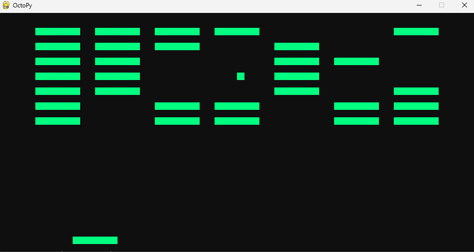

# OctoPy - Chip-8 Emulator

A CHIP-8 Emulator/Interpreter written in Python
## Overview 
OctoPy is a complete Chip-8 emulator that includes both the CPU emulator and a full graphical user interface. It can run classic Chip-8 games and applications with accurate timing and behavior.
## Features
### CPU emulation(`cpu.py`)
 - An amazing 4096 bytes of RAM
 - 16 8 bit registers(V0-VF)
 - 64x32 pixel monochrome display
 - Working delay and sound timers
 - Full opcode implementation
 - Working input
 - Sprite drawing and collision detection
 - ROM loading support
### GUI App(`main.py`)
 - Pygame based display(15x scaling from original Chip-8 display)
 - Interactive menu with:
    - Example game ROMS(Sourced from [this repo](https://github.com/kripod/chip8-roms) and [this repo](https://johnearnest.github.io/chip8Archive/))
    - Emulator test suite(Sourced from [Timendus' repo](https://github.com/Timendus/chip8-test-suite/))
    - Custom ROM loading
    - Custom instructions per frame configuration
 - Pygame based sound
 - Complete keyboard mapping(displayed in menu)

## Files
- `font.py` - Chip-8 font sprites (16 characters)
- `cpu.py` - Main emulator core
- `main.py` - GUI application
- `roms/` - Example games
- `testroms/` - Emulator test suite

## Quick Start
## Running from source
**Requirements**
 - Git
 - Python 3.12-13
1. First clone the repo
```
git clone https://github.com/thecheetoman/octoPy.git
```
2. Install pip packages
```
cd octoPy
pip install -r requirements.txt
```
3. Run the emulator!
```
python3 main.py
```
## Running from a pre-compiled .exe(Windows x64 only!)
1. Download the emulator from github releases
[Link to releases just in case you are lazy like me and dont want to click it on the right side bar](https://github.com/thecheetoman/octoPy/releases)
2. Unzip the folder
3. Open the folder, Run OctoPy.exe!

## Usage
Keybinds are as follows
```text
 CHIP-8       Keyboard
┌───┬───┬───┬───┐
│ 1 │ 2 │ 3 │ C │ -> 1 2 3 4
├───┼───┼───┼───┤
│ 4 │ 5 │ 6 │ D │ -> Q W E R
├───┼───┼───┼───┤
│ 7 │ 8 │ 9 │ E │ -> A S D F
├───┼───┼───┼───┤
│ A │ 0 │ B │ F │ -> Z X C V
└───┴───┴───┴───┘
```
OctoPy comes with two games, here are the controls:
**Br8kOut** - A & D to move side to side
**1 player Pong** - 1 & Q

You can switch games at any time by pressing **esc**

